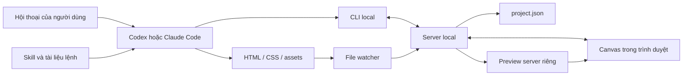

# Local Design Canvas — Implementation Plan

> **For agentic workers:** REQUIRED SUB-SKILL: Use `superpowers:executing-plans` to implement this plan task-by-task. Use `superpowers:subagent-driven-development` only when the user chooses delegated execution. Steps use checkbox (`- [ ]`) syntax for tracking.

**Goal:** Xây dựng ứng dụng thiết kế UI chạy local, có canvas nhiều màn hình và skill để Codex hoặc Claude Code tự khởi động ứng dụng, tạo thiết kế, xem kết quả và chỉnh sửa theo hội thoại.

**Architecture:** Agent tạo và sửa HTML/CSS trong workspace; CLI quản lý project, màn hình và vòng đời server. Server local lưu metadata, theo dõi file và đẩy sự kiện cho canvas trong trình duyệt. Ứng dụng không gọi model: khả năng tạo thiết kế đến từ agent mà người dùng đang sử dụng.

**Tech Stack:** TypeScript, Node.js từ 22.12, npm workspaces, React + Vite cho canvas, Fastify cho HTTP server, Zod cho schema, Chokidar cho file watching, Vitest và Playwright cho kiểm thử. Canvas dùng DOM/CSS transforms; bản đầu chưa cần thư viện đồ họa chuyên dụng.

**Spec:** Đặc tả sản phẩm và các quyết định kiến trúc nằm ngay trong tài liệu này, tại mục [Phạm vi và hành vi sản phẩm](#phạm-vi-và-hành-vi-sản-phẩm) và [Hợp đồng dữ liệu và giao tiếp](#hợp-đồng-dữ-liệu-và-giao-tiếp).

**Ngày:** 2026-09-25.

**Trạng thái:** Đã triển khai M1–M3 (Tasks 1–11) trong workspace; thêm `reference fetch` sau kế hoạch gốc. Chi tiết kiểm chứng: `.superpowers/sdd/2026-09-25-local-design-canvas/progress.md`. Checkbox trong tài liệu này là bản gốc lúc lập kế hoạch và không được đồng bộ lại từng mục.

## Global Constraints

- Runtime: Node.js >= 22.12; khóa phiên bản dependency đã kiểm tra tương thích trong `package-lock.json` khi triển khai.
- macOS là nền tảng nghiệm thu bản đầu; không công bố hỗ trợ Windows/Linux trước khi kiểm tra riêng.
- UI, server, file thiết kế và assets chạy/lưu local; agent vẫn có thể sử dụng dịch vụ AI từ xa.
- Không yêu cầu API key của một nhà cung cấp model bên trong ứng dụng canvas.
- Bản đầu hỗ trợ HTML/CSS/JavaScript thuần; không chạy build script hoặc cài dependency từ từng thiết kế.
- UI của ứng dụng và template mặc định không tải font, CSS hoặc JavaScript từ CDN.
- Server chỉ bind `127.0.0.1`; chỉ phục vụ các project đã đăng ký trong workspace được chọn.
- Agent sửa nội dung thiết kế; metadata project chỉ được ghi qua server, kể cả khi người dùng kéo màn hình trên canvas.
- Đường dẫn file thiết kế được lưu tương đối với project; runtime state chứa đường dẫn tuyệt đối đã chuẩn hóa.
- Mỗi workspace có tối đa một server đang hoạt động; cho phép nhiều workspace chạy ở các cổng khác nhau.
- Cập nhật nội dung không reset vị trí màn hình hoặc mức zoom của canvas.
- Không tự ghi đè skill đã cài, xóa thiết kế, sửa cấu hình agent hay tạo commit trong repository của người dùng.
- Task hoàn thành khi đạt kiểm chứng của task; toàn bộ checkbox trong kế hoạch ban đầu để trống.

## Review Focus

1. Khởi động hai lần hoặc đồng thời, state cũ, cổng bị chiếm: tái sử dụng đúng server hoặc báo lỗi; không dừng tiến trình không thuộc ứng dụng. Kiểm tra tại Task 2.
2. Workspace có dấu cách, Unicode, `../` hoặc symlink ra ngoài project: đường dẫn hợp lệ hoạt động; truy cập ngoài phạm vi bị từ chối. Kiểm tra tại Task 1 và Task 3.
3. Hai cửa sổ cùng kéo màn hình, agent ghi nhiều file liên tục hoặc manifest lỗi: không mất metadata, không crash toàn bộ app, hiển thị lỗi có thể xử lý. Kiểm tra tại Task 1, Task 4 và Task 5.
4. JavaScript trong preview cố gọi API quản lý hoặc điều hướng cửa sổ cha: preview vẫn được cô lập. Kiểm tra tại Task 3 và Task 6.
5. Mất kết nối, restart server hoặc đóng tab giữa lúc lưu: UI kết nối lại, đọc trạng thái mới và báo thao tác chưa lưu. Kiểm tra tại Task 4, Task 5 và Task 7.

## Phạm vi và hành vi sản phẩm

### Trải nghiệm chính

Người dùng chat trong Codex hoặc Claude Code: “Thiết kế ba màn hình quản lý bán hàng”. Skill hướng dẫn agent mở ứng dụng, tạo project và các màn hình, viết file giao diện. Canvas hiển thị các màn hình cạnh nhau. Người dùng tiếp tục yêu cầu sửa qua hội thoại; màn hình liên quan cập nhật trong trình duyệt.

Canvas có sidebar project/màn hình, vùng pan/zoom, toolbar và thông tin màn hình được chọn. Có hai chế độ:

- **Arrange:** chọn, kéo, thay đổi kích thước viewport của khung màn hình; overlay nhận pointer để iframe không chiếm thao tác.
- **Interact:** cho phép click, nhập liệu và cuộn bên trong preview; nút hoặc phím Escape chuyển về Arrange.

Kích thước khung là kích thước viewport thực của thiết kế. Zoom canvas chỉ thay đổi cách nhìn, không thay đổi breakpoint CSS bên trong iframe.

### Ba mốc phát hành

| Mốc | Phạm vi | Điều kiện nghiệm thu |
| --- | --- | --- |
| M1 — Local canvas dùng được | Task 1–7: CLI, server, lưu project, canvas, live update, skill và gói cài local | Từ hội thoại tạo được ba màn hình; sửa một màn hình cập nhật đúng preview; đóng/mở lại giữ thiết kế và bố cục |
| M2 — Agent nhìn và sửa thiết kế | Task 8–9: ảnh chụp, lỗi render, design tokens, variants, snapshots | Agent đọc được ảnh preview, sửa lỗi có quan sát; có thể khôi phục một phiên bản đã lưu |
| M3 — Ngữ cảnh chọn phần tử và MCP | Task 10–11: selection bridge, context CLI, MCP adapter | Chọn phần tử rồi yêu cầu trong hội thoại; agent đọc đúng ngữ cảnh và sửa đúng màn hình |

M1 là lát cắt triển khai đầu tiên. M2 và M3 xây tiếp trên các hợp đồng của M1; đánh giá lại giao diện thao tác bằng kết quả sử dụng thực tế trước mỗi mốc.

### Ngoài phạm vi bản đầu

- Editor vector/layer đầy đủ như Figma; chỉnh sửa tự do từng node bằng kéo thả.
- Chat AI tích hợp trong canvas, tự gọi model hoặc quản lý tài khoản nhà cung cấp AI.
- Đồng bộ cloud, cộng tác nhiều người hoặc chạy app qua mạng LAN.
- Desktop shell Electron/Tauri, plugin marketplace và nhập file Figma.
- Build ứng dụng React/Vue tùy ý từ thiết kế hoặc tự cài package do agent sinh ra.
- Tự kích hoạt một lượt chạy Codex/Claude Code khi người dùng click trên canvas.

### Quyết định và đánh đổi

1. **HTML trong iframe:** giữ được code và tương tác thật; chưa cung cấp hệ thống layer có thể chỉnh trực quan như Figma.
2. **CLI trước MCP:** agent dùng shell có thể vận hành app; MCP là adapter bổ sung ở M3.
3. **Browser trước desktop:** mở bằng URL local, giảm công việc đóng gói đa nền tảng.
4. **File trước database:** dễ đọc bằng agent, sao lưu và đưa vào Git; server chịu trách nhiệm chống ghi đè metadata.
5. **HTML/CSS thuần trước framework:** giảm cấu hình cho từng màn hình; việc tích hợp code vào ứng dụng production là bước phát triển riêng.

## Hợp đồng dữ liệu và giao tiếp

### Luồng dữ liệu



### Workspace của người dùng

```text
design-workspace/
  .local-canvas/
    runtime.json           # PID, cổng, instance ID, token; bỏ khỏi Git
    server.log             # Chẩn đoán local, không ghi token
  projects/
    shop-dashboard/
      project.json         # ID, revision, màn hình, bố cục
      design-system.css    # Tokens dùng chung
      screens/
        overview/
          index.html
          styles.css
          script.js        # Không bắt buộc
        order-detail/
          index.html
          styles.css
      assets/
      snapshots/           # M2: phiên bản có manifest và file nguồn
      artifacts/           # M2: ảnh chụp, lỗi render
```

Skill và runtime nằm trong gói ứng dụng, không nằm trong từng project. Gỡ hoặc nâng cấp gói ứng dụng không xóa workspace thiết kế.

### Schema dùng chung

```ts
export type Screen = {
  id: string;
  name: string;
  entry: string; // Ví dụ: screens/overview/index.html
  x: number;
  y: number;
  width: number;
  height: number;
};

export type Project = {
  schemaVersion: 1;
  revision: number;
  id: string;
  name: string;
  screens: Screen[];
};

export type ScreenLayoutPatch = {
  id: string;
  x?: number;
  y?: number;
  width?: number;
  height?: number;
};

export type CanvasEvent = {
  sequence: number;
  instanceId: string;
  projectId: string;
  screenIds: string[];
  type: 'project.updated' | 'screen.changed' | 'project.error';
  message?: string;
};

export type Result<T> =
  | { ok: true; data: T }
  | { ok: false; error: { code: string; message: string } };
```

ID dùng slug ASCII chữ thường, chữ số và dấu gạch ngang; tên hiển thị cho phép tiếng Việt. `width`/`height` là số nguyên từ 240 đến 4096; tọa độ phải hữu hạn. Server kiểm tra `schemaVersion`; phiên bản chưa hỗ trợ phải báo lỗi và không sửa file.

Manifest được ghi bằng file tạm rồi rename trên cùng filesystem, qua hàng đợi theo project. Mỗi mutation có `expectedRevision`; revision không khớp trả `REVISION_CONFLICT`. Client tải lại trạng thái và chỉ áp lại patch của thao tác hiện tại. Hỏng JSON phải giữ nguyên file để người dùng phục hồi.

### CLI dự kiến

Tên binary đề xuất: `local-canvas`. Mọi lệnh hỗ trợ `--workspace <absolute-or-relative-path>` và `--json`. `stdout` ở chế độ JSON chỉ chứa một `Result<T>`; log ghi vào `stderr`. Thành công exit 0, lỗi exit 1.

```bash
local-canvas start --workspace ./design-workspace --open --json
local-canvas status --workspace ./design-workspace --json
local-canvas project create shop-dashboard --name "Quản lý bán hàng" --json
local-canvas project list --json
local-canvas screen add overview --project shop-dashboard --width 1440 --height 1000 --json
local-canvas screen list --project shop-dashboard --json
local-canvas screen update overview --project shop-dashboard --x 1600 --y 0 --json
local-canvas stop --workspace ./design-workspace --json
```

Khi không chỉ định `--workspace`, dùng thư mục làm việc hiện tại; không ghi ngầm vào thư mục cài skill. Các lệnh project/screen yêu cầu server đã chạy và báo `SERVER_NOT_RUNNING` nếu thiếu. ID màn hình chỉ cần duy nhất trong project. Các lệnh tạo trả đường dẫn tuyệt đối để agent biết nơi viết HTML/CSS.

M2 bổ sung `screenshot`, `screen duplicate`, `snapshot create`, `snapshot restore`. M3 bổ sung `selection get` và `mcp serve`.

### HTTP và sự kiện

| Endpoint | Dữ liệu/ý nghĩa |
| --- | --- |
| `GET /health` | App ID, protocol version, instance ID, capabilities; không trả token hoặc file path |
| `POST /api/shutdown` | Yêu cầu có token; đóng server của đúng instance |
| `GET /api/projects` | Danh sách project |
| `POST /api/projects` | `{ id, name }` → project và đường dẫn |
| `GET /api/projects/:id` | Project hiện tại |
| `POST /api/projects/:id/screens` | `{ id, name, width, height, expectedRevision }` |
| `PATCH /api/projects/:id/layout` | `{ patches: ScreenLayoutPatch[], expectedRevision }` |
| `GET /api/events` | SSE có sequence và instance ID |
| Preview origin: `/projects/:id/*` | Chỉ đọc file thiết kế thuộc project |

API dùng `Result<T>`; map lỗi thành HTTP 400/401/403/404/409/500 theo loại. Server quản lý và preview chạy ở hai port khác nhau để tách origin. Preview nằm trong iframe có sandbox cho script; không cho top navigation, popup hoặc truy cập DOM ứng dụng quản lý.

API quản lý dùng token phiên, không đưa token vào file thiết kế hoặc log. CLI đọc token từ runtime state quyền `0600`; UI nhận token qua URL fragment lúc mở, chuyển vào memory rồi xóa fragment khỏi URL. UI gọi API với bearer token; SSE đọc bằng `fetch` streaming để hỗ trợ cùng header. Khi reload, có thể lấy lại token từ session storage của origin quản lý; khi server đổi phiên, UI yêu cầu mở lại bằng CLI. Preview không được nhận token. Kiểm tra Host/Origin và từ chối Origin không hợp lệ trên API quản lý.

SSE không phải nơi lưu dữ liệu chuẩn. Mỗi lần kết nối lại, client tải lại manifest; sequence chỉ giúp phát hiện thiếu sự kiện. Mất server phải hiện trạng thái reconnecting, không giả vờ lưu thành công.

## Cấu trúc source code dự kiến

```text
package.json
package-lock.json
tsconfig.base.json
packages/
  core/src/
    schema.ts              # Schema, types, validators
    paths.ts               # Chuẩn hóa và giới hạn đường dẫn
    project-store.ts       # Read/write metadata, revision, atomic writes
  server/src/
    app.ts                 # Routes quản lý và auth
    lifecycle.ts           # Start/status/stop, lock, runtime state
    preview.ts             # Read-only static preview origin
    events.ts              # SSE stream
    watcher.ts             # Map file changes sang màn hình
    capture.ts             # M2: ảnh chụp và lỗi render
    snapshots.ts           # M2: phiên bản nguồn
    selection.ts           # M3: lưu ngữ cảnh được chọn
  cli/src/
    index.ts               # Parser và JSON output
    client.ts              # Gọi API và map lỗi
  canvas/src/
    App.tsx
    api.ts
    events.ts
    features/projects/ProjectSidebar.tsx
    features/canvas/CanvasViewport.tsx
    features/canvas/ScreenFrame.tsx
    features/canvas/viewport-math.ts
    features/canvas/layout-state.ts
    features/selection/SelectionOverlay.tsx  # M3
  preview-bridge/src/index.ts               # M3: selection trong iframe
  mcp/src/index.ts                          # M3: adapter tool
skills/local-design-canvas/
  SKILL.md
  references/commands.md
  references/design-workflow.md
  scripts/run.mjs
scripts/
  build-release.mjs
  install-skill.mjs
templates/basic-screen/
tests/unit/
tests/integration/
tests/e2e/
tests/fixtures/
vitest.config.ts
playwright.config.ts
README.md
```

Skill là hướng dẫn mỏng; logic vận hành nằm trong runtime/CLI và có test. `run.mjs` tìm runtime đi kèm bằng đường dẫn của chính script, không phụ thuộc thư mục đang đứng và không tải package ngầm mỗi lần chạy.

## Kế hoạch triển khai M1

Các đoạn code bên dưới là hợp đồng và ví dụ kiểm chứng bắt buộc, không phải toàn bộ implementation. Khi triển khai, thêm imports và fixture tương ứng trong file test đã chỉ định. Mỗi task chỉ bổ sung kiểm thử hành vi có rủi ro; không tạo test chỉ để khớp nguyên văn tài liệu hoặc JSX.

### Task 1: Workspace, schema và lưu project

**Files:** Tạo root package/config, `packages/core/package.json`, `packages/core/src/{schema,paths,project-store}.ts`, `tests/unit/project-store.test.ts`, `tests/unit/paths.test.ts`, `vitest.config.ts`.

**Interfaces:**

```ts
createProject(workspace: string, input: { id: string; name: string }): Promise<Project>
readProject(workspace: string, projectId: string): Promise<Project>
updateLayout(workspace: string, projectId: string, patches: ScreenLayoutPatch[], expectedRevision: number): Promise<Project>
resolveProjectFile(projectRoot: string, relativePath: string): Promise<string>
```

- [ ] Khởi tạo npm workspaces; scripts root gồm `build`, `typecheck`, `test`, `test:e2e`. Cấu hình TypeScript strict và Vitest với thư mục tạm độc lập cho mỗi test.
- [ ] Viết test lưu/mở lại project, tên Unicode, path có dấu cách, ID trùng, revision conflict, JSON hỏng và symlink vượt project. Ví dụ test dùng `fixture` do `beforeEach` tạo bằng `mkdtemp`:

```ts
it('không làm mất thay đổi khi client dùng revision cũ', async () => {
  const p = await createProject(fixture.workspace, { id: 'shop', name: 'Cửa hàng' });
  await updateLayout(fixture.workspace, p.id, [], p.revision);
  await expect(updateLayout(fixture.workspace, p.id, [], p.revision))
    .rejects.toMatchObject({ code: 'REVISION_CONFLICT' });
});
```

- [ ] Chạy `npm test -- tests/unit/project-store.test.ts tests/unit/paths.test.ts`; trước implementation, xác nhận test thất bại vì chức năng thiếu.
- [ ] Implement validation, giới hạn đường dẫn qua `realpath`, hàng đợi theo project và atomic manifest write. Project mới có revision 0 và danh sách màn hình rỗng. Không theo symlink thoát project.
- [ ] Chạy lại hai test file và `npm run typecheck`; xác nhận manifest lỗi vẫn giữ nguyên byte, project hợp lệ mở lại được.

**Deliverable:** Dữ liệu project có hợp đồng rõ, lưu/mở lại được và không bị lost update.

### Task 2: Vòng đời server và CLI start/status/stop

**Files:** Tạo `packages/server/package.json`, `packages/server/src/{app,lifecycle}.ts`, `packages/cli/package.json`, `packages/cli/src/{index,client}.ts`, `tests/integration/lifecycle.test.ts`.

**Consumes:** Canonical workspace path từ Task 1.

**Produces:**

```ts
type RuntimeInfo = { instanceId: string; pid: number; url: string; previewUrl: string };
ensureServer(workspace: string): Promise<RuntimeInfo>
getServerStatus(workspace: string): Promise<RuntimeInfo | null>
stopServer(workspace: string): Promise<void>
```

- [ ] Viết integration test gọi `start` hai lần và đồng thời, state cũ, cổng cố định bị chiếm và workspace có dấu cách. Test chỉ dọn tiến trình do test tạo.

```ts
it('hai lần start cùng workspace trả cùng instance', async () => {
  const [a, b] = await Promise.all([
    ensureServer(fixture.workspace), ensureServer(fixture.workspace),
  ]);
  expect(a.instanceId).toBe(b.instanceId);
  expect(a.url).toBe(b.url);
});
```

- [ ] Chạy `npm test -- tests/integration/lifecycle.test.ts` để xác nhận các case mới thất bại trước implementation.
- [ ] Implement lock khởi động độc quyền, spawn server với log file, health handshake tối đa 10 giây và runtime state ghi atomically. OS tự cấp cổng mặc định; chỉ báo port conflict khi người dùng chọn port cụ thể.
- [ ] Implement `start --open`, `status`, `stop`, `--json`; mở trình duyệt bằng argument array, không nối chuỗi shell. `stop` dùng API xác thực, không kill một PID chỉ vì có trong file state.
- [ ] Chạy test; kiểm tra `status` không tự tạo server và stdout không chứa token. Server sống sau khi lệnh `start` thoát; dừng server phải đóng cả preview origin.

**Deliverable:** Agent mở được runtime ổn định và gọi lại an toàn trong cùng workspace.

### Task 3: API project/screen và preview cô lập

**Files:** Sửa `packages/server/src/app.ts`, `packages/cli/src/{index,client}.ts`; tạo `packages/server/src/preview.ts`, `templates/basic-screen/{index.html,styles.css}`, `tests/integration/projects-api.test.ts`, `tests/integration/preview.test.ts`.

**Consumes:** Project store và runtime từ Task 1–2.

**Produces:** Các route project/layout/preview trong bảng HTTP và `project create/list`, `screen add/list/update` trong CLI.

- [ ] Viết test tạo màn hình trả đường dẫn entry tồn tại, giữ nguyên nội dung khi ID trùng, viewport sai bị từ chối; API thiếu token trả 401.

```ts
it('API quản lý yêu cầu xác thực', async () => {
  const response = await fetch(`${fixture.runtime.url}/api/projects`);
  expect(response.status).toBe(401);
});
```

- [ ] Viết test preview chỉ đọc: từ chối traversal đã URL-encode, symlink escape và file runtime; không có API ghi trên preview origin. Kiểm tra Origin lạ bị từ chối dù gửi request từ trình duyệt.
- [ ] Chạy `npm test -- tests/integration/projects-api.test.ts tests/integration/preview.test.ts`; implement routes và auth theo các case đã viết.
- [ ] Tạo màn hình bằng template HTML có link CSS cục bộ, viewport meta và `data-screen-id`; link `../../design-system.css`. Nếu tạo template thất bại, không để manifest tham chiếu màn hình chưa có.
- [ ] Chạy lại test; tạo hai màn hình và mở URL preview bằng trình duyệt để kiểm tra CSS/ảnh relative path.

**Deliverable:** CLI tạo UI source sử dụng được; preview không có quyền điều khiển ứng dụng quản lý.

### Task 4: File watcher và live update

**Files:** Tạo `packages/server/src/{watcher,events}.ts`, `tests/integration/live-update.test.ts`; sửa bootstrap server để đóng watcher/SSE khi shutdown.

**Consumes:** Project schemas và static preview routes.

**Produces:** `CanvasEvent` qua `GET /api/events`; thay đổi file màn hình chỉ phát event cho màn hình tương ứng, thay đổi tokens/assets chung thông báo tất cả màn hình trong project.

- [ ] Viết test sửa HTML/CSS phát event đúng project/screen; burst save gộp thành một lần thông báo sau khi ổn định; không theo dõi `artifacts`, `snapshots` hoặc runtime logs.

```ts
it('sửa token chung thông báo các màn hình của project', async () => {
  const next = fixture.waitForEvent('screen.changed');
  await fixture.write('design-system.css', ':root { --accent: #2563eb; }');
  expect((await next).screenIds.sort()).toEqual(['orders', 'overview']);
});
```

- [ ] Implement debounce 150 ms và chờ file ổn định; không cam kết nhiều file ghi rời là một transaction. File thiếu hoặc lỗi đọc phát `project.error` và cho phép lần save tiếp theo phục hồi.
- [ ] Implement SSE sequence, instance ID, heartbeat 15 giây, cleanup connection và giới hạn buffer cho client chậm.
- [ ] Chạy `npm test -- tests/integration/live-update.test.ts`; test disconnect/reconnect bằng helper đọc SSE qua `fetch`, xác nhận lấy lại manifest hiện tại bù cho event đã mất.

**Deliverable:** Agent chỉ cần lưu file; server tự thông báo để UI cập nhật.

### Task 5: Canvas nhiều màn hình và lưu bố cục

**Files:** Tạo `packages/canvas/package.json`, `packages/canvas/index.html`, `packages/canvas/vite.config.ts`, `packages/canvas/src/{main.tsx,App.tsx,api.ts,events.ts}`, các file `features/projects` và `features/canvas` trong cây source; tạo `tests/unit/viewport-math.test.ts`, `tests/e2e/canvas.spec.ts`, `playwright.config.ts`.

**Consumes:** API project/layout, SSE và URL preview.

**Produces:** Canvas pan/zoom, chọn project, chọn/kéo/resize khung màn hình và toolbar tạo màn hình. Nút nhân bản xuất hiện cùng chức năng tương ứng ở M2.

```ts
type Viewport = { x: number; y: number; zoom: number };
screenToCanvas(point: { x: number; y: number }, viewport: Viewport): { x: number; y: number }
// canvasX = (screenX - viewport.x) / viewport.zoom; tương tự cho Y.
```

- [ ] Viết unit test phép đổi tọa độ với zoom 0.25, 1 và 2; viết E2E kéo khung khi zoom rồi reload để xác nhận vị trí được lưu.

```ts
expect(screenToCanvas({ x: 300, y: 180 }, { x: 100, y: 80, zoom: 2 }))
  .toEqual({ x: 100, y: 50 });
```

- [ ] Implement sidebar và canvas DOM; zoom quanh con trỏ từ 0.1–2.0, pan bằng Space + drag hoặc trackpad, fit-all và indicator mức zoom. Pointer capture cho thao tác kéo.
- [ ] Implement Arrange/Interact, width/height inspector, empty/loading/error states. Persist vị trí/kích thước qua layout API lúc kết thúc thao tác; pan/zoom là state local theo project.
- [ ] Implement optimistic layout update: hiện trạng thái đang lưu, retry patch khi revision conflict; mất kết nối giữ thao tác ở trạng thái chưa lưu và cho phép retry, không báo đã lưu.
- [ ] Kết nối SSE; reload riêng iframe thay đổi bằng revision query parameter. Mỗi lần reconnect tải lại project rồi làm mới các preview cần thiết; đổi server session phải hiển thị hướng dẫn mở lại.
- [ ] Chạy `npm test -- tests/unit/viewport-math.test.ts` và `npm run test:e2e -- tests/e2e/canvas.spec.ts`; kiểm tra CSS breakpoint dựa trên width khung, không dựa trên zoom.

**Deliverable:** Người dùng nhìn được nhiều màn hình, sắp xếp chúng và quay lại trạng thái đã lưu.

### Task 6: Cô lập preview và kiểm tra trình duyệt

**Files:** Sửa `packages/canvas/src/features/canvas/ScreenFrame.tsx`, `packages/server/src/{app,preview}.ts`; tạo `tests/fixtures/preview-isolation.html`, `tests/e2e/preview-isolation.spec.ts`.

**Consumes:** Hai origin và chế độ Arrange/Interact từ Task 3–5.

**Produces:** Iframe sandbox và header policy đã kiểm chứng bằng browser thật.

- [ ] Tạo fixture script thử đọc DOM cha, đọc token, mở popup, điều hướng top window và POST API quản lý; mỗi kết quả ghi vào phần text của fixture để test đọc.
- [ ] Viết E2E xác nhận app shell còn hoạt động, số project không đổi và dữ liệu token không bị lộ; một nút demo trong preview vẫn click được ở chế độ Interact.

```ts
await page.getByRole('button', { name: 'Interact' }).click();
await page.frameLocator('[data-screen-id="demo"] iframe')
  .getByRole('button', { name: 'Tăng' }).click();
await expect(page.frameLocator('[data-screen-id="demo"] iframe')
  .getByText('Giá trị: 1')).toBeVisible();
```

- [ ] Thiết lập sandbox tối thiểu cần thiết, tách auth khỏi preview, chặn top navigation và bỏ phản hồi CORS không cần thiết trên API quản lý.
- [ ] Chạy `npm run test:e2e -- tests/e2e/preview-isolation.spec.ts`; kiểm tra zoom/drag không làm click nhầm nội dung iframe.

**Deliverable:** Thiết kế có JavaScript sử dụng được mà không có quyền sửa project ngoài API được agent gọi.

### Task 7: Skill, gói phân phối local và nghiệm thu M1

**Files:** Tạo `skills/local-design-canvas/{SKILL.md,references/commands.md,references/design-workflow.md,scripts/run.mjs}`, `scripts/{build-release,install-skill}.mjs`, `README.md`, `tests/integration/release.test.ts`, `tests/e2e/m1-acceptance.spec.ts`; cập nhật build root.

**Consumes:** CLI/API và canvas đã build từ Task 1–6.

**Produces:** Release directory chứa skill và runtime dựng sẵn; CLI chạy được từ vị trí cài khác source repository.

- [ ] Build runtime Node thành `dist/cli.mjs`, bundle server và tạo static canvas assets. `build-release.mjs` ghép các thành phần vào thư mục release; không yêu cầu Vite dev server khi sử dụng.
- [ ] Implement runner dùng `import.meta.url` tìm binary đi kèm và chuyển tiếp argument bằng `spawn(process.execPath, args)`; `--workspace` được chuyển nguyên vẹn.
- [ ] Viết release test copy gói sang thư mục tạm có dấu cách, chạy `start --json`, tạo project/màn hình, stop/start và đọc lại dữ liệu. Thực hiện bằng child process thật, không mock CLI client.
- [ ] Viết skill với workflow: đọc status → start nếu cần → chọn/tạo project → đọc tokens/màn hình → viết file → xem trạng thái/lỗi → báo kết quả. Chỉ yêu cầu screenshot nếu runtime công bố capability này ở M2.
- [ ] Viết installer nhận `--target <directory>` tường minh, kiểm tra target có tồn tại, mặc định từ chối ghi đè. Tài liệu hướng dẫn đăng ký skill riêng cho Codex và Claude Code sau khi kiểm tra cơ chế skill thực tế của từng công cụ lúc triển khai; không giả định cùng một thư mục discovery.
- [ ] Kiểm tra thực tế skill trong cả hai agent bằng cùng prompt nghiệm thu. Nếu không có một agent trong môi trường kiểm tra, ghi rõ chưa xác minh agent đó; không gộp thành kết quả pass.
- [ ] Chạy `npm run build`, `npm run typecheck`, `npm test` và `npm run test:e2e`. Chạy release smoke test khi tắt mạng sau khi dependency đã được cài; các màn hình mặc định phải vẫn hiển thị.

**Kịch bản nghiệm thu M1:**

1. Workspace trống; yêu cầu agent thiết kế “Tổng quan”, “Đơn hàng”, “Chi tiết đơn hàng”.
2. Agent mở app bằng skill; ba khung xuất hiện trên canvas với HTML/CSS thật.
3. Yêu cầu đổi sidebar của “Tổng quan”; chỉ nội dung liên quan được agent sửa, preview cập nhật và canvas giữ vị trí/zoom.
4. Kéo màn hình, thay viewport, dùng Interact để thử nút và cuộn.
5. Stop/start ứng dụng; kiểm tra file và bố cục còn nguyên.
6. Ngắt server khi đang mở canvas; UI báo mất kết nối. Khởi động và mở lại đúng phiên; dữ liệu đã lưu được phục hồi.

**Deliverable:** Gói skill + ứng dụng chạy local có thể dùng từ hội thoại thực tế.

## Kế hoạch mở rộng M2

### Task 8: Chụp preview và thu thập lỗi render

**Files:** Tạo `packages/server/src/capture.ts`, `tests/integration/capture.test.ts`; sửa CLI, API và skill references.

**Interface:**

```ts
type CaptureResult = {
  imagePath: string;
  width: number;
  height: number;
  errors: { type: 'console' | 'page' | 'resource'; message: string }[];
};
captureScreen(workspace: string, projectId: string, screenId: string): Promise<CaptureResult>
```

- [ ] Viết test screenshot có kích thước viewport đúng, asset 404 và lỗi JS được ghi nhận; fixture animation/timer liên tục không làm capture treo.
- [ ] Implement bằng Playwright Chromium trong browser context mới không có token quản lý; render cùng iframe sandbox và kích thước như canvas, rồi chụp riêng vùng preview. Chờ DOM/font/ảnh với timeout tổng 10 giây thay vì chờ network idle vô hạn. Lưu PNG và diagnostics vào `artifacts`, không sửa nguồn thiết kế.
- [ ] Thêm `local-canvas screenshot overview --project shop-dashboard --json`. Browser thiếu phải trả `BROWSER_NOT_INSTALLED` và hướng dẫn cài; không tải browser âm thầm trong lệnh capture.
- [ ] Chạy `npm test -- tests/integration/capture.test.ts`; kiểm tra file PNG không rỗng và image dimensions đúng bằng decoder, không chỉ kiểm tra exit code.
- [ ] Bổ sung vòng lặp skill: capture → agent đọc ảnh/lỗi → sửa → capture lại. Giới hạn mặc định ba vòng sửa cho một yêu cầu; nếu chưa đạt, báo điểm chưa đạt để tránh vòng lặp vô hạn.

**Deliverable:** Agent có bằng chứng hình ảnh để kiểm tra thiết kế; không chỉ dựa vào nội dung source.

### Task 9: Design tokens, variants và snapshots

**Files:** Tạo `packages/server/src/snapshots.ts`, `tests/integration/variants-snapshots.test.ts`; sửa template, project API, CLI và canvas toolbar.

**Interfaces:**

```ts
duplicateScreen(workspace: string, projectId: string, screenId: string, newId: string): Promise<Screen>
createSnapshot(workspace: string, projectId: string): Promise<{ snapshotId: string }>
restoreSnapshot(workspace: string, projectId: string, snapshotId: string): Promise<{ backupSnapshotId: string }>
```

- [ ] Viết test variant có ID/path độc lập, giữ link tới tokens chung, sửa variant không đổi bản gốc; tên mới trùng phải báo conflict.
- [ ] Implement duplicate bằng copy source screen và đặt khung mới cạnh khung gốc; không tạo URL phụ thuộc source screen.
- [ ] Viết test snapshot gồm manifest, HTML/CSS và assets; loại runtime, `snapshots` lồng nhau và `artifacts`. Snapshot trong lúc file đang thay đổi phải retry hữu hạn hoặc trả `PROJECT_BUSY`, không công bố bản sao dở dang là hợp lệ.
- [ ] Implement snapshot vào staging directory rồi rename; restore kiểm tra snapshot trước, tạo backup trạng thái hiện tại rồi thay nguồn, tăng revision và thông báo refresh tất cả màn hình. Nếu thao tác restore lỗi, rollback từ backup.
- [ ] Chạy `npm test -- tests/integration/variants-snapshots.test.ts`; sửa/xóa asset giữa hai phiên bản rồi restore để xác nhận nội dung phục hồi đầy đủ.

**Deliverable:** Người dùng so sánh phương án và khôi phục thiết kế; metadata và file nguồn thuộc cùng một snapshot.

## Kế hoạch mở rộng M3

### Task 10: Chọn phần tử và truyền ngữ cảnh cho agent

**Files:** Tạo `packages/preview-bridge/src/index.ts`, `packages/server/src/selection.ts`, `packages/canvas/src/features/selection/SelectionOverlay.tsx`, `tests/e2e/selection.spec.ts`; sửa CLI và skill references.

**Interface:**

```ts
type SelectionContext = {
  projectId: string;
  screenId: string;
  sourceRevision: string;
  elementId: string | null;
  selector: string;
  text: string;
  bounds: { x: number; y: number; width: number; height: number };
};
```

- [ ] Quy định template/skill ưu tiên `data-design-id` ổn định cho phần tử quan trọng. Không cam kết ánh xạ DOM bất kỳ sang dòng source tuyệt đối.
- [ ] Inject bridge vào bản HTML được phục vụ, không ghi bridge vào file nguồn. Bridge gửi selection bằng `postMessage`; shell xác thực `event.source` đúng iframe, schema, ID màn hình và nonce từng frame, kể cả trường hợp sandbox tạo opaque origin.
- [ ] Implement Select mode có overlay và CLI `selection get --project shop-dashboard --json`; server lưu ngữ cảnh mới nhất. `sourceRevision` là hash nội dung file của màn hình và tokens dùng chung, khác revision metadata của project. Hash thay đổi làm selection cũ thành stale; agent phải yêu cầu chọn lại hoặc đọc ngữ cảnh mới trước khi sửa. `bounds` dùng CSS pixels theo viewport chưa zoom của iframe.
- [ ] Viết E2E chọn nút khi canvas zoom 0.5, xác nhận đúng bounds/text/screen; giả mạo message từ frame khác phải bị bỏ qua. Reload màn hình không giữ selector cũ như thể còn hợp lệ.
- [ ] Chạy `npm run test:e2e -- tests/e2e/selection.spec.ts`; thử hội thoại “đổi nút đang chọn thành màu xanh” bằng cách agent đọc CLI context.

**Deliverable:** Lựa chọn trên canvas trở thành ngữ cảnh rõ ràng cho lượt hội thoại tiếp theo, không tự tạo lượt chạy agent.

### Task 11: MCP adapter trên các chức năng hiện có

**Files:** Tạo `packages/mcp/src/index.ts`, `tests/integration/mcp.test.ts`; cập nhật package scripts và tài liệu kết nối.

**Consumes:** Cùng service/API mà CLI sử dụng; không tạo project store hoặc lifecycle thứ hai.

**Produces:** MCP stdio tools: `canvas_status`, `project_list`, `project_create`, `screen_list`, `screen_add`, `screen_capture`, `selection_get`.

- [ ] Chọn và khóa SDK MCP theo tài liệu chính thức tại thời điểm bắt đầu M3; map input/output của mỗi tool từ schema đã có.
- [ ] Implement `local-canvas mcp serve --workspace <path>`; stdout dành riêng cho giao thức, log vào stderr. Tool khởi động hoặc kết nối đúng runtime theo workspace.
- [ ] Viết integration test gọi cùng thao tác bằng CLI và MCP, so sánh dữ liệu project; invalid ID, server unavailable và stale selection phải trả lỗi có cấu trúc tương đương.
- [ ] Chạy `npm test -- tests/integration/mcp.test.ts`; kết nối thử trong từng agent được hỗ trợ và chỉ cập nhật tài liệu cho cấu hình đã xác minh.

**Deliverable:** CLI và MCP là hai cách truy cập cùng ứng dụng; người dùng có thể tiếp tục dùng skill + CLI nếu không cần MCP.

## Kiểm chứng và tiêu chí hoàn thành

- Unit tests: validation, path containment, revision conflict, coordinate transforms.
- Integration tests: server lifecycle, API/CLI, file watcher, release bundle; M2/M3 thêm capture/snapshot/MCP.
- Browser tests: pan/zoom/drag, Arrange/Interact, preview isolation, reconnect; M3 thêm selection.
- Manual acceptance: cùng workflow qua Codex và Claude Code, trên release bundle và workspace mới.
- Không dùng pixel-perfect screenshot assertion để đánh giá “thiết kế đẹp”; kiểm tra clipping/readability/layout bằng review ảnh có ngữ cảnh.
- Mục tiêu trải nghiệm M1: với project ba màn hình trên máy nghiệm thu, save file ổn định → iframe bắt đầu cập nhật trong khoảng một giây; ghi lại số đo thực tế thay vì coi đây là bảo đảm trên mọi máy.
- Mỗi mốc phải có build, typecheck và bộ test liên quan pass; ghi rõ các kiểm tra chưa chạy và nguyên nhân.
- Commit theo task chỉ khi repository đã dùng Git và workflow được người dùng yêu cầu/chấp thuận; tài liệu này không tự tạo commit hoặc repository.

## Thứ tự thực hiện

```text
M1: Task 1 → 2 → 3 → 4 → 5 → 6 → 7 → nghiệm thu với agent thật
M2: Task 8 → 9 → nghiệm thu vòng lặp tạo / nhìn / sửa / phục hồi
M3: Task 10 → 11 → nghiệm thu selection và MCP
```

Bắt đầu bằng M1 để kiểm chứng trải nghiệm chính trước khi mở rộng editor. Không yêu cầu thiết kế trước một hệ thống layer như Figma để đạt được workflow prompt → UI → canvas local.

## Tài liệu kỹ thuật tham chiếu

- [Vite — Getting Started](https://vite.dev/guide/): yêu cầu runtime Node và cách build frontend. Kế hoạch chọn Node >= 22.12 để phù hợp yêu cầu Vite được kiểm tra lúc viết.
- [MDN — Server-sent events](https://developer.mozilla.org/en-US/docs/Web/API/Server-sent_events/Using_server-sent_events): định dạng stream và reconnect; ứng dụng dùng fetch streaming để kèm header xác thực.
- [Playwright — Browsers](https://playwright.dev/docs/browsers): browser binaries là bước cài riêng; cần ghi rõ trong quy trình phát triển và capability screenshot của M2.

Các thư viện cụ thể phải được kiểm tra phiên bản và license khi khóa dependency. Kế hoạch không phụ thuộc một bản SDK của Codex, Claude hoặc nhà cung cấp model.
